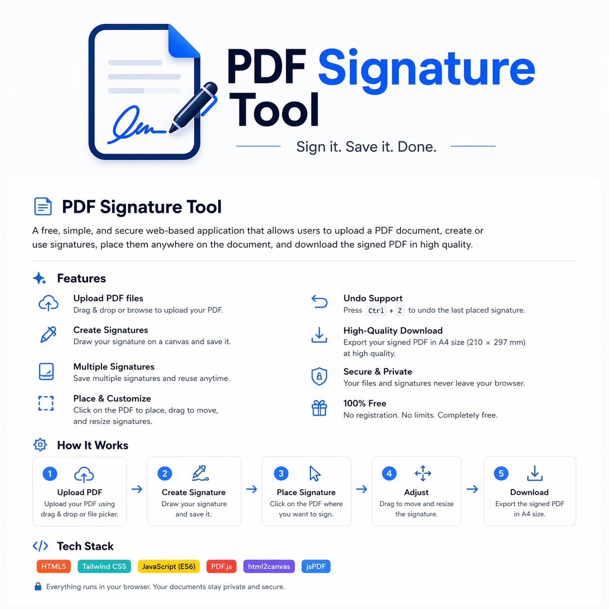

#  PDF Signature Tool

A free, browser-based PDF signing application that allows users to upload documents, create digital signatures, and place them anywhere on a PDF before downloading the final signed file in high quality (A4 or Letter format).

---

## Features

###  PDF Upload
- Drag & drop or select a PDF file
- Instant rendering using PDF.js

### Signature Creation
- Draw custom signatures using a canvas
- Save multiple signatures for reuse

###  Signature Placement
- Click anywhere on the PDF to place a signature
- Drag to reposition freely
- Resize signatures dynamically

###  Undo
- Undo last placed signature with `CTRL + Z`

###  High-Quality Export
- Export signed document in **A4 format (210 × 297 mm)**
- Maintains layout accuracy and high resolution

---

## Tech Stack

- HTML + CSS (TailwindCSS)
- JavaScript (ES)
- PDF.js (PDF rendering)
- html2canvas (capture pages)
- jsPDF (PDF export engine)

---

##  Privacy First

Everything runs locally in the browser:
- No file uploads to servers
- No data tracking
- Fully client-side processing

---

##  Use Cases

- Contracts
- Forms
- School documents
- Freelance agreements
- Internal office paperwork

---

##  Future Improvements
- if Ever.
- Digital certificate signatures
- Cloud saving
- Multi-user signing flow
- Mobile touch optimization